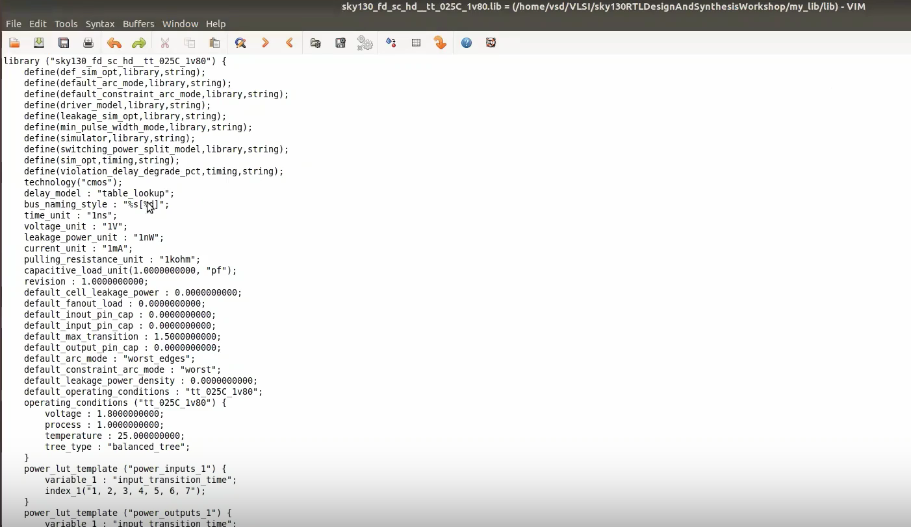
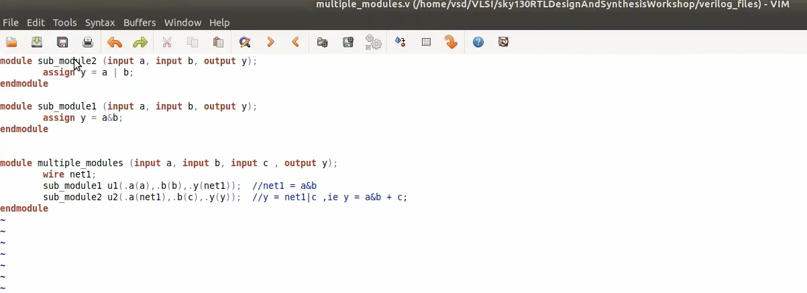
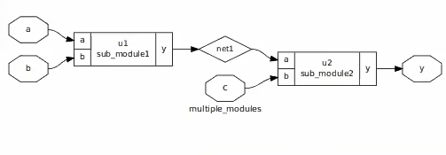
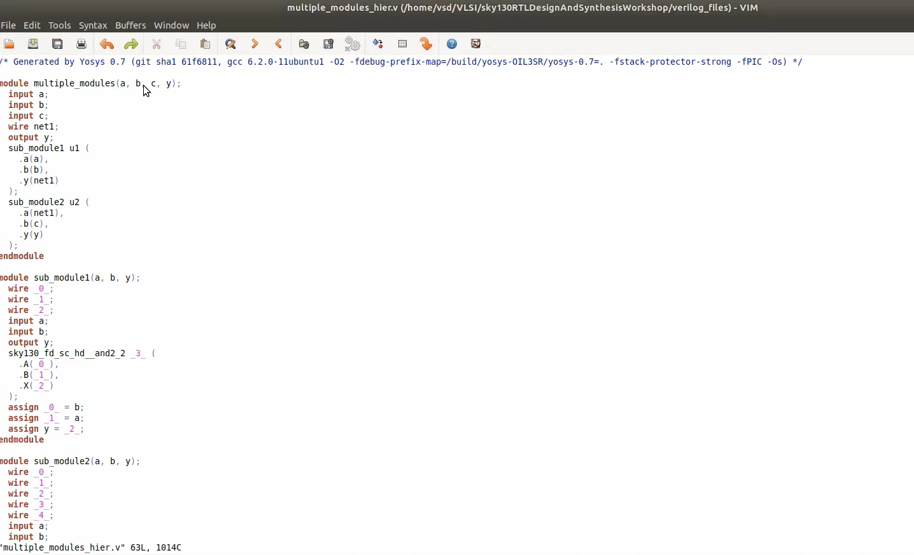
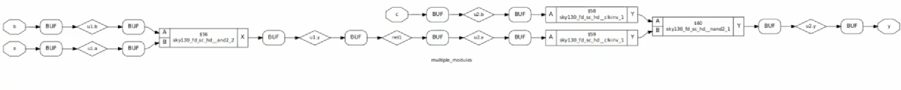
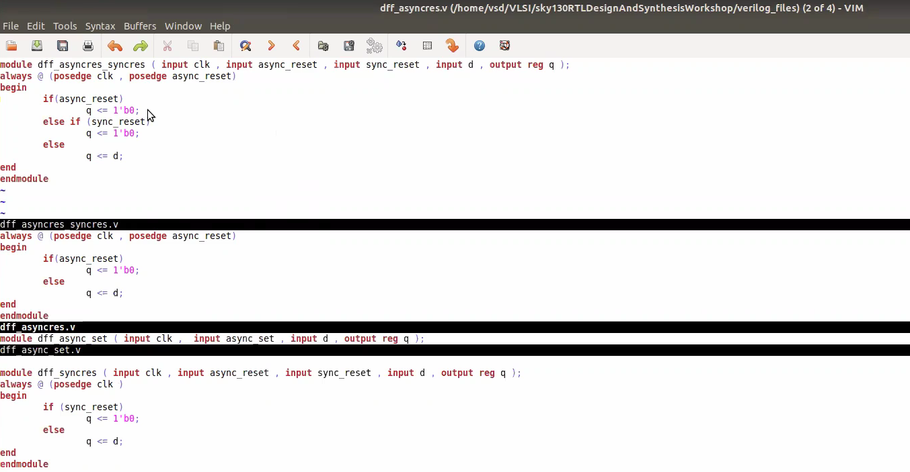
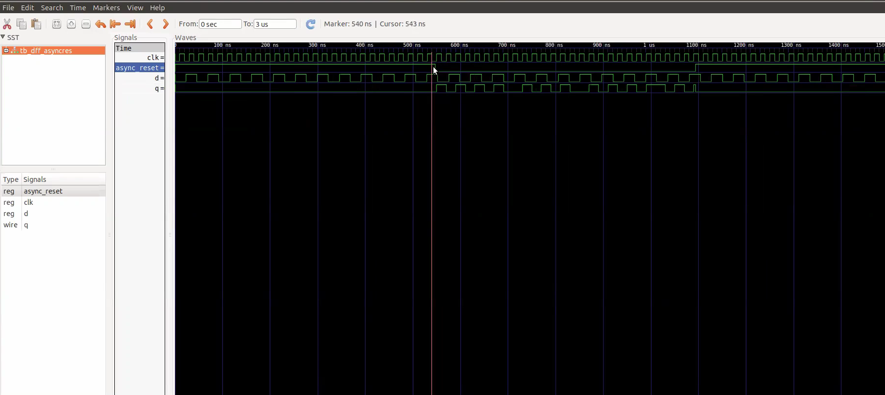
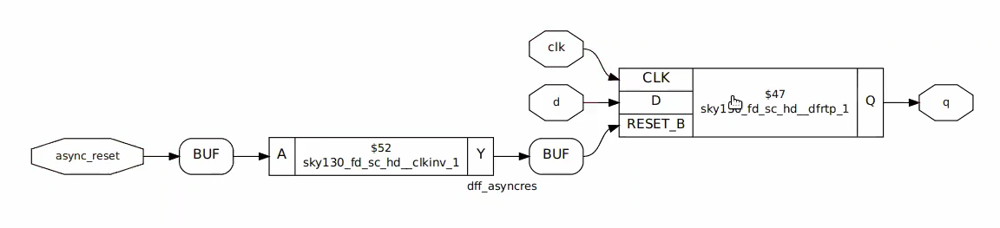
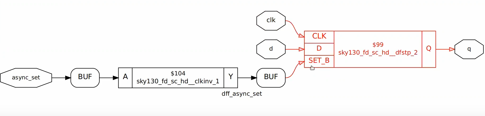

# 📘 Day 2 – Timing Libs, Hierarchical vs Flat Synthesis, and Efficient Flop Coding Styles

## 📑 Table of Contents
- [📂 Introduction to Timing .lib Files](#1-📂-introduction-to-timing-lib-files)
- [🏗️ Hierarchical vs Flat Synthesis](#2-🏗️-hierarchical-vs-flat-synthesis)
- [⚙️ Efficient Flop Coding Styles and Optimization](#3-⚙️-efficient-flop-coding-styles-and-optimization)
- [✅ Summary](#✅-summary)

---

## 1. 📂 Introduction to Timing .lib Files

**Timing libraries** describe the delay, functionality, and power of digital standard cells.

They are essential for synthesis tools like Yosys to generate accurate gate-level representations.

```bash
gvim ./lib/sky130_fd_sc_hd__tt_025C_1v80.lib
```


## 2. 🏗️ Hierarchical vs Flat Synthesis

-**Hierarchical Synthesis** maintains the design’s module hierarchy.

-**Flat Synthesis** merges all modules into a single level for optimization.

```bash 
gvim multiple_modules.v
```



Run Yosys Synthesis:

```bash
yosys
read_liberty -lib ./lib/sky130_fd_sc_hd__tt_025C_1v80.lib
read_verilog multiple_modules.v
synth -top multiple_modules
abc -liberty ./lib/sky130_fd_sc_hd__tt_025C_1v80.lib
show
```


```bash
write_verilog multiple_modules_hier.v
!gvim multiple_modules_hier.v
```


```bash
yosys
read_liberty -lib ./lib/sky130_fd_sc_hd__tt_025C_1v80.lib
read_verilog multiple_modules.v
synth -top multiple_modules
abc -liberty ./lib/sky130_fd_sc_hd__tt_025C_1v80.lib
flatten
show
```


```bash
exit
```


## 3. ⚙️ Efficient Flop Coding Styles and Optimization

Various ways of coding flip-flops can affect synthesis and simulation.



```bash
iverilog dff_async.v tb_dff_async.v
./a.out
gtkwave dff_async.vcd
```



Yosys Synthesis Flow:

```bash
yosys
read_liberty -lib ./lib/sky130_fd_sc_hd__tt_025C_1v80.lib
read_verilog dff_async.v
synth -top dff_async
dfflibmap -liberty ./lib/sky130_fd_sc_hd__tt_025C_1v80.lib
abc -liberty ./lib/sky130_fd_sc_hd__tt_025C_1v80.lib
show
```


Alternative Style with dff_async_set.v

```bash
read_verilog dff_async_set.v
synth -top dff_async_set
dfflibmap -liberty ./lib/sky130_fd_sc_hd__tt_025C_1v80.lib
```



## ✅ Summary
🧠 Understood how .lib files represent timing and power data for cells.

🧱 Learned differences between hierarchical and flat synthesis techniques.

💡 Explored how different flip-flop coding styles impact the gate-level outcome.

🔧 Practiced synthesis commands using Yosys and analyzed waveform with GTKWave.
