# 🧠 Day 3 - Combinational and Sequential Optimizations

---

## 📚 Table of Contents

- [✅ Introduction to Optimizations](#-introduction-to-optimizations)
- [🔧 Combinational Logic Optimization](#-combinational-logic-optimization)
  - [🔍 Boolean Logic Optimization - Example](#-boolean-logic-optimization---example)
  - [🛠️ Yosys Commands for Combinational Optimization](#️-yosys-commands-for-combinational-optimization)
    - [🔁 opt-check](#-opt-check)
    - [🔁 opt-check2](#-opt-check2)
- [🔁 Sequential Logic Optimizations](#-sequential-logic-optimizations)
  - [📘 Example: dff_const1.v and dff_const2.v](#-example-dff_const1v-and-dff_const2v)
  - [Yosys Flow for dff_const1.v](#yosys-flow-for-dff_const1v)
  - [Yosys Flow for dff_const2.v](#yosys-flow-for-dff_const2v)
  - [GTKWave Simulation](#gtkwave-simulation)
- [🎯 Sequential Optimization for Unused Outputs](#-sequential-optimization-for-unused-outputs)
  - [Clone and Modify](#clone-and-modify)
- [📌 Summary](#-summary)

---

## ✅ Introduction to Optimizations

In this session, we explore optimization techniques for both **combinational** and **sequential** logic to create efficient designs in terms of area, power, and speed.

---

## 🔧 Combinational Logic Optimization

Combinational logic optimization is the process of minimizing the logic to achieve:

- Reduced **area**
- Lower **power consumption**
- Improved **performance**

### Techniques:
- **Constant Propagation**
- **Direct Optimization**
- **Boolean Logic Optimization**
  - Karnaugh Maps (K-map)
  - Quine–McCluskey method

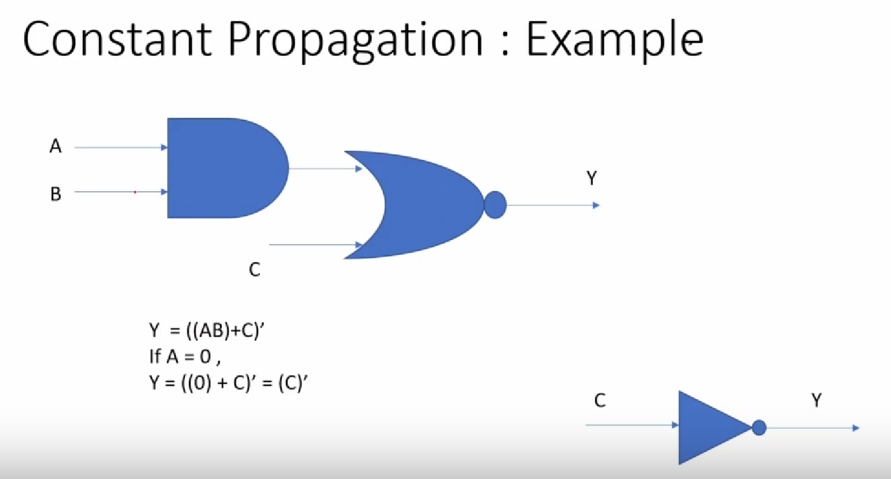

---

### 🔍 Boolean Logic Optimization - Example

```verilog
assign y = a & b & c | (c & a & !d) | (!c);
```
### M-' Sequential logic Optimization

-Basic
     -Sequential constant propagation
-Advanced
     -State optimization
     -Retiming
     -Sequential Logic cloning

# List files
```
ls *opt*
```

# Run yosys flow
```yosys
> read_liberty -lib ./lib/sky130_fd_sc_hd__tt_025C_1v80.lib
> read_verilog opt-check.v
> synth -top opt-check
> opt_clean -purge
> abc -liberty ./lib/sky130_fd_sc_hd__tt_025C_1v80.lib
> show
```
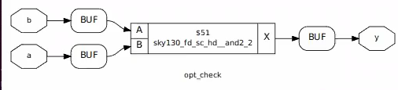

``` yosys
> read_verilog opt-check2.v
> synth -top opt-check2
> opt_clean -purge
> abc -liberty ./lib/sky130_fd_sc_hd__tt_025C_1v80.lib
> show
```
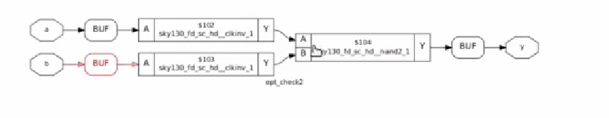

## Sequential Logic Optimizations

These optimizations target state-holding elements like flip-flops and include:


📘 Example: dff_const1.v and dff_const2.v
# Simulate using gvim and iverilog

```
gvim dff_const1.v -o dff_const2.v
```
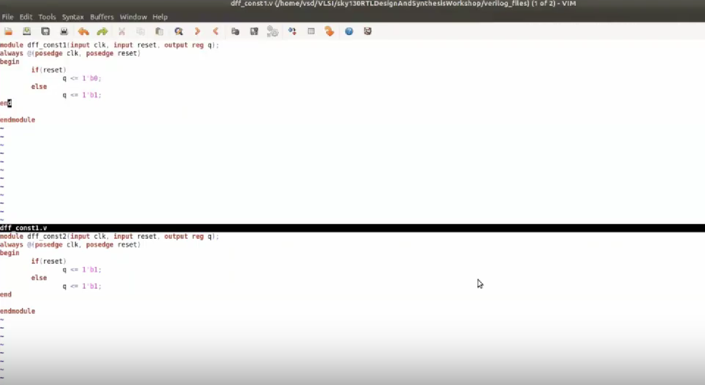


```
iverilog dff_const1.v tb_dff_const1.v
./a.out
gtkwave tb_dff_const1.vcd &
```
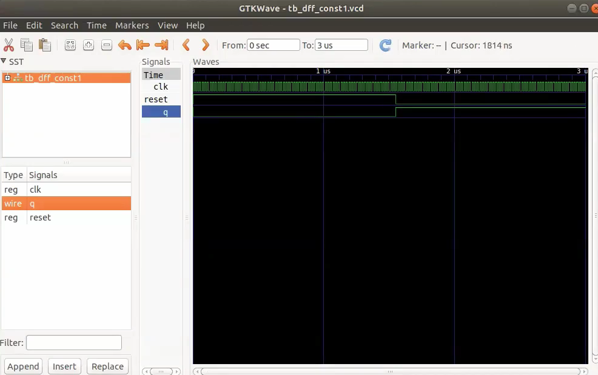

Yosys Flow for dff_const1

```yosys
> read_liberty -lib ./lib/sky130_fd_sc_hd__tt_025C_1v80.lib
> read_verilog dff_const1.v
> synth -top dff_const1
> dfflibmap -liberty ./lib/sky130_fd_sc_hd__tt_025C_1v80.lib
> abc -liberty ./lib/sky130_fd_sc_hd__tt_025C_1v80.lib
> show
```
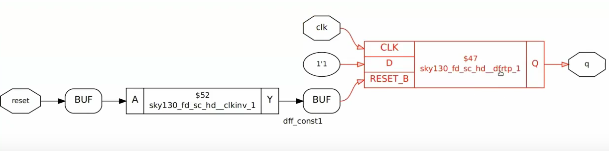

Yosys Flow for dff_const2.v

```yosys
> read_verilog dff_const2.v
> synth -top dff_const2
> dfflibmap -liberty ./lib/sky130_fd_sc_hd__tt_025C_1v80.lib
> abc -liberty ./lib/sky130_fd_sc_hd__tt_025C_1v80.lib
> show
```
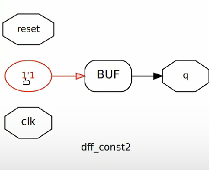

GTKWave Simulation

# Simulate both files

```
iverilog dff_const3.v tb_dff_const3.v
./a.out
gtkwave tb_dff_const3.vcd &
```
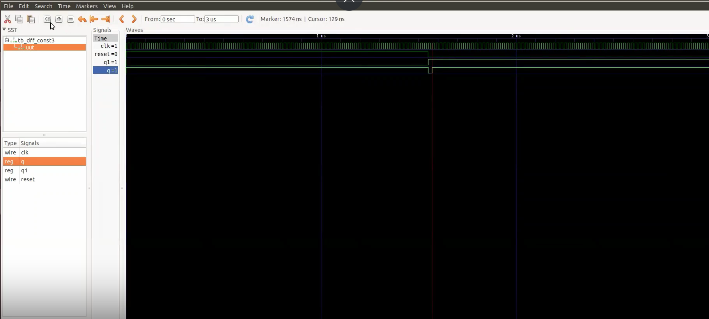


#🎯 Sequential Optimization for Unused Outputs
In this scenario, we focus on optimizing circuits that have unused outputs which should be eliminated during optimization.


# simulate and optimize

```yosys
> read_liberty -lib ./lib/sky130_fd_sc_hd__tt_025C_1v80.lib
> read_verilog counter_opt.v
> synth -top counter_opt
> dfflibmap -liberty ./lib/sky130_fd_sc_hd__tt_025C_1v80.lib
> abc -liberty ./lib/sky130_fd_sc_hd__tt_025C_1v80.lib
> show
```
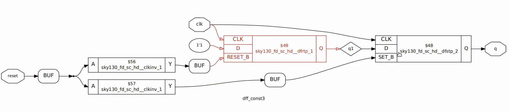

```
gvim counter_opt.v
```
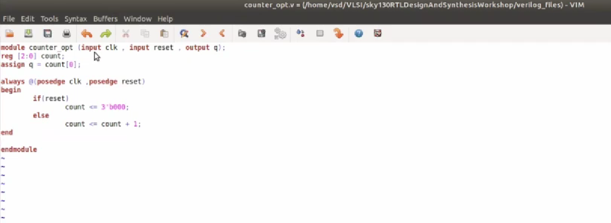

```yosys
> read_liberty -lib ./lib/sky130_fd_sc_hd__tt_025C_1v80.lib
> read_verilog counter_opt.v
> synth -top counter_opt
> dfflibmap -liberty ./lib/sky130_fd_sc_hd__tt_025C_1v80.lib
> abc -liberty ./lib/sky130_fd_sc_hd__tt_025C_1v80.lib
> show
```
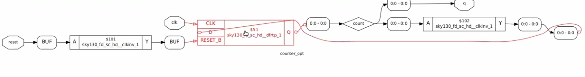


Clone and Modify
# Make a copy of the Verilog file

```
gvim counter_opt.v
cp counter_opt.v counter_opt2.v
gvim counter_opt2.v
```
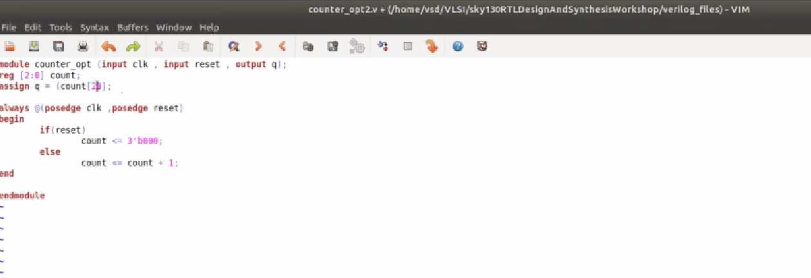

### 📌 Summary
-Combinational and sequential logic can be optimized with Yosys to reduce area and power.

-Commands like opt_clean, abc, and dfflibmap help perform low-level optimizations.

-GTKWave helps visualize the results.

-Techniques like constant propagation and retiming are critical for sequential logic.

