# Day 4 - GLS, Blocking vs Non-Blocking and Synthesis-Simulation Mismatch

## Table of Contents

1. [GLS, Synthesis-Simulation Mismatch and Blocking/Non-blocking Statements](#gls-synthesis-simulation-mismatch-and-blockingnon-blocking-statements)

   * Introduction to Gate Level Simulation (GLS)
   * What is GLS
   * Why GLS is important
   * Using IVERILOG for GLS
   * Synthesis-Simulation Mismatch
   * Missing Senstivity List
   * Blocking and Non blocking statement in verilog
   * Caveats with blocking statement
2. [Labs on GLS and Synthesis-Simulation Mismatch](#labs-on-gls-and-synthesis-simulation-mismatch)
3. [Labs on Synth-Sim Mismatch for Blocking Statement](#labs-on-synth-sim-mismatch-for-blocking-statement)
4. [Summary](#summary)
---

## GLS, Synthesis-Simulation Mismatch and Blocking/Non-blocking Statements

### Introduction to Gate Level Simulation (GLS) & Synthesis-Simulation Mismatches

### What is GLS?

* Running the testbench with Netlist as Design Under Test (DUT).
* Netlist is logically same as RTL code.
* Same testbench will align with the Design.

### Why GLS?

* Verify the **logical correctness** of design after synthesis.
* Ensure **timing of the design** is met.

  * GLS needs to be run with delay annotation (not covered in this discussion).

### GLS using IVERILOG

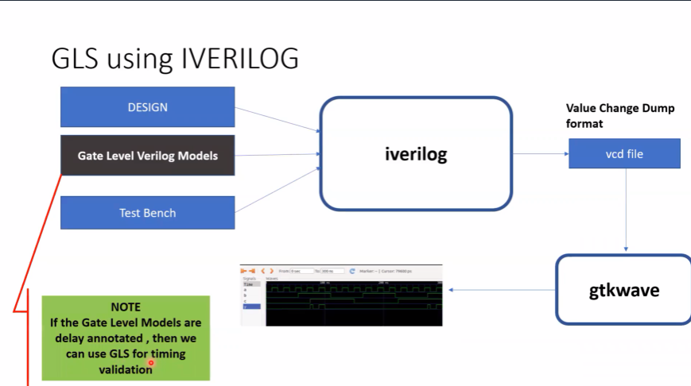

### Synthesis-Simulation Mismatch

* Causes:

  * Missing sensitivity list
  * Blocking (`=`) vs Non-blocking (`<=`) assignments
  * Non-standard Verilog coding

---

### Missing senstivity list

```
module mux(
	input i0, input i1
	input sel,
	output reg y
);
always @ (sel)
begin
	if(sel)
		y=i1;
	else
		y=i0;
end
endmodule
```


```
module mux(
        input i0, input i1
        input sel,
        output reg y
);
always @ (*)
begin
        if(sel)
                y=i1;
        else
                y=i0;
end
endmodule
```

### Blocking and Non Blocking statement in verilog

- Inside always block
	. = -> Blocking
		. Executes the statement in the order it is written
		. So the first statement is evaluated before the second statement
	. <= -> Non blocking
		. Executes all the RHS when always block is entered and assign to LHS
		. Parallel Evaluation

### Caveat with blocking statement

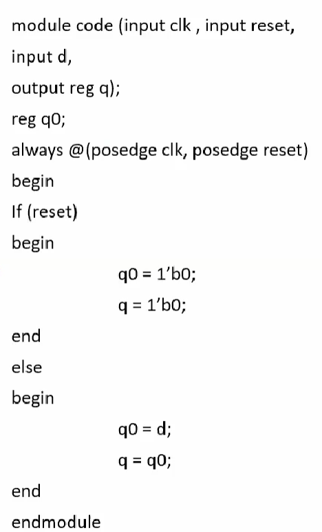

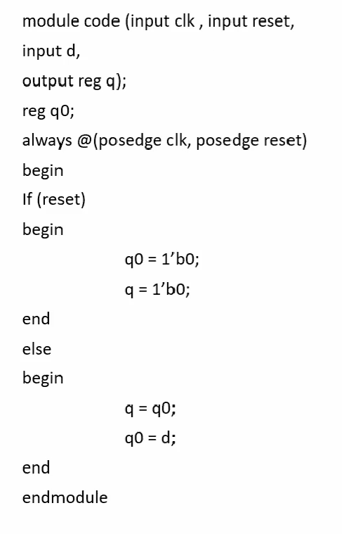

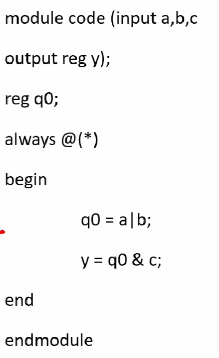

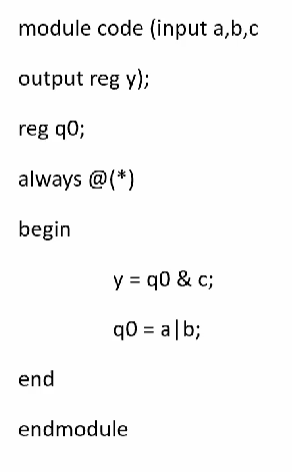

## Labs on GLS and Synthesis-Simulation Mismatch

```sh
gvim ternary_operator_mux.v -o good_mux.v
```

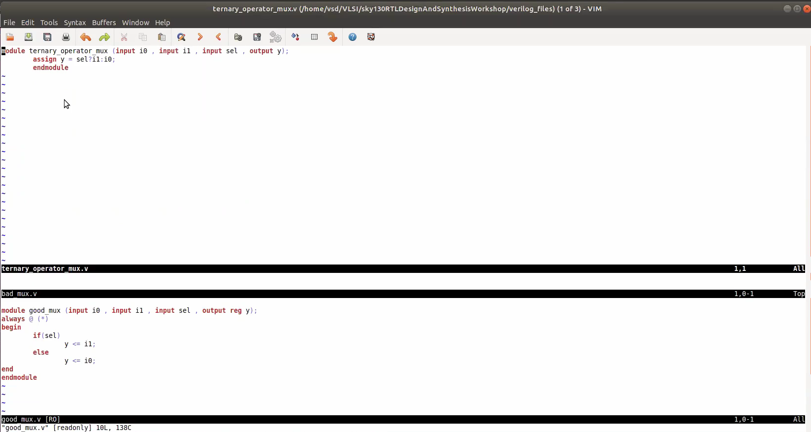

```
iverilog ternary_operator_mux.v tb_ternary_operator_mux.v
./a.out
gtkwave tb_ternary_operator_mux.vcd
```

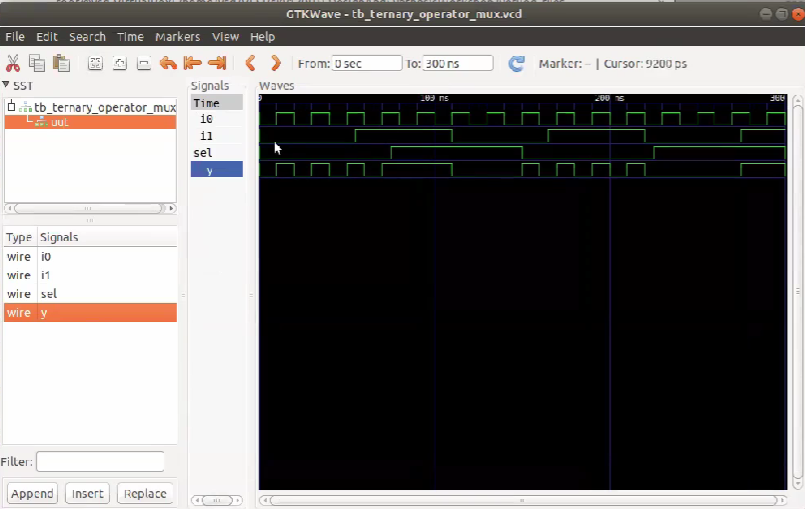


```sh
yosys 
read_liberty -lib ./lib/sky130_fd_sc_hd__tt_025C_1v80.lib
read_verilog ternary_operator_mux.v
synth -top ternary_operator_mux
abc -liberty /address/to/your/sky130/file/sky130_fd_sc_hd__tt_025C_1v80.lib
write_verilog -noattr ternary_operator_mux_net.v
show
```
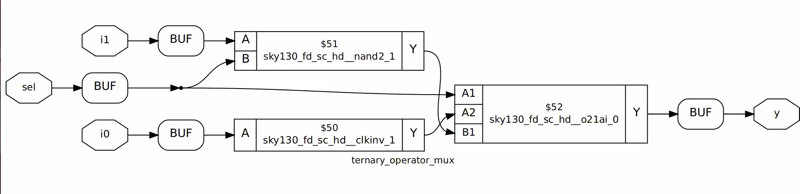

```
iverilog ./my_lib/verilog_model/primitives.v ./my_lib/verilog_model/sky130_fd_sc_hd.v ./verilog_files/ternary_operator_mux.v ./verilog_files/tb_ternary_operator_mux.v
./a,out
gtkwave tb_ternary_operator_mux.vcd
```
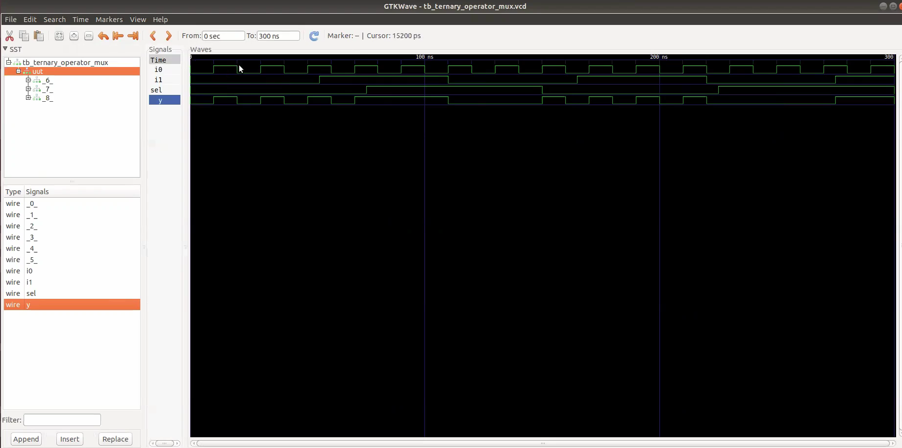


```sh
iverilog good_mux.v tb-good_mux.v
./a.out
gtkwave tb-good_mux.vcd
```
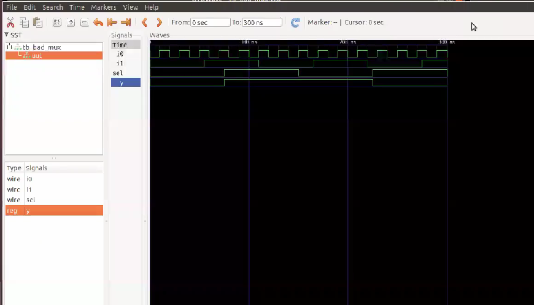
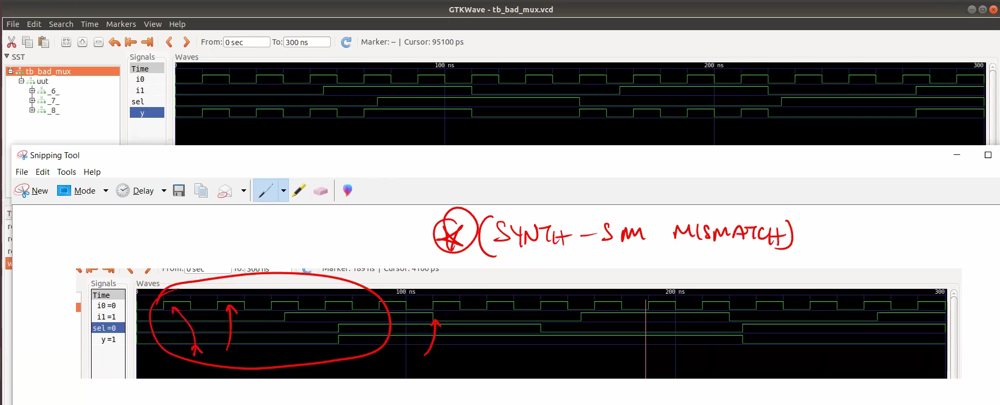


## Labs on Synth-Sim Mismatch for Blocking Statement

### Sensitivity List Example

```verilog
module mux(input a, input b, output reg y);
always @(a)
y = a & b;
endmodule
```

```verilog
module mux(input a, input b, output reg y);
always @(a or b)
y = a & b;
endmodule
```
### Lab Commands

```sh
iverilog blocking_caveat.v tb-blocking_caveat.v
./a.out
gtkwave tb-blocking_caveat.vcd
```
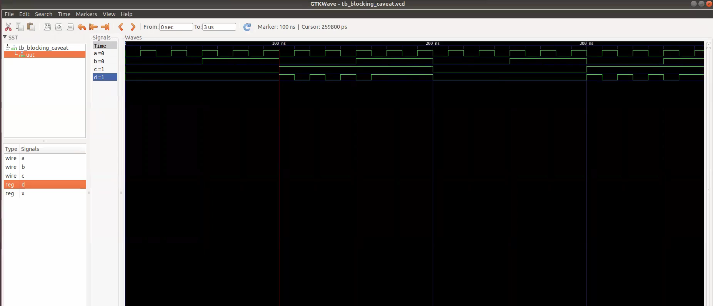


```sh
yosys
read_verilog blocking_caveat.v
synth -top blocking_caveat
dfflibmap -liberty ./lib/sky130_fd_sc_hd__tt_025C_1v80.lib
abc -liberty ./lib/sky130_fd_sc_hd__tt_025C_1v80.lib
show
```
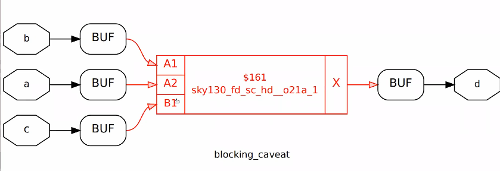

```sh
iverilog ./my_lib/verilog_model/primitives.v ./my_lib/verilog_model/sky130_fd_sc_hd.v ./verilog_files/bad_mux_net.v ./verilog_files/tb_bad_mux.v
./a.out
gtkwave tb_blocking_caveat.vcd
```
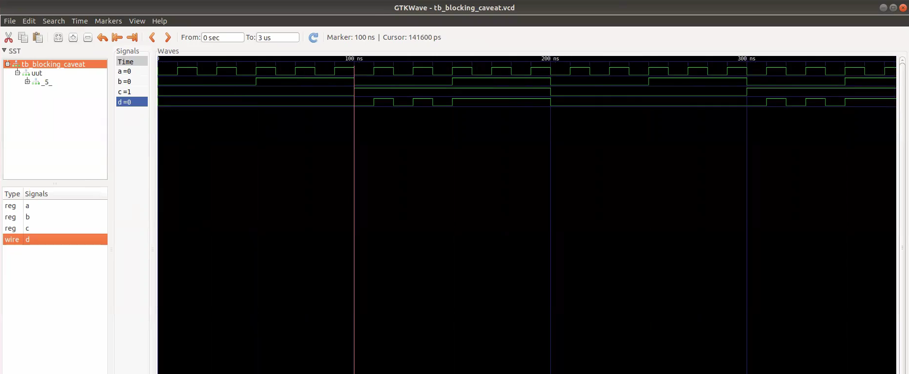
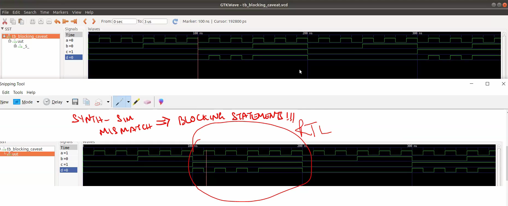

## Summary

* **Gate-Level Simulation (GLS)** verifies the functionality of the synthesized netlist using the same RTL testbench.
* **Synthesis-Simulation mismatches** occur due to improper coding practices like missing sensitivity lists or incorrect use of blocking (`=`) vs non-blocking (`<=`) assignments.
* **Blocking (`=`)** executes sequentially and can cause incorrect behavior in sequential circuits if not used carefully.
* **Non-blocking (`<=`)** should be used in sequential logic to ensure predictable behavior.
* **GLS** helps ensure the design works correctly after synthesis and before fabrication or handoff.

