# 📘 Day 5 – Optimization in Synthesis

## 📑 Table of Contents
1. [If Case Constructs](#1-if-case-constructs)  
2. [Labs on "Incomplete If Case"](#2-labs-on-incomplete-if-case)  
3. [Labs on "Incomplete Overlapping Case"](#3-labs-on-incomplete-overlapping-case)  
4. [For Loop and For Generate](#4-for-loop-and-for-generate)  
5. [Labs on "For Loop and For Generate"](#5-labs-on-for-loop-and-for-generate)  
6. [Summary](#6-summary)  

---

## 1️⃣ If Case Constructs

Conditional logic plays a key role in digital design. `if`, `case`, and nested conditions are used to implement complex control structures.

However, if not written carefully (e.g., missing `default` or `else` clauses), they can lead to **latch inference** and synthesis mismatches.

---

## 2️⃣ 🧪 Labs on "Incomplete If Case"

**Example: incomplete `if` case (no else)**

```verilog
module bad_case(input a, output reg y);
  always @(*) begin
    if (a)
      y = 1;
    // No else – may infer a latch!
  end
endmodule
```

**Run Commands:**

```
gvim *incomp -o
```
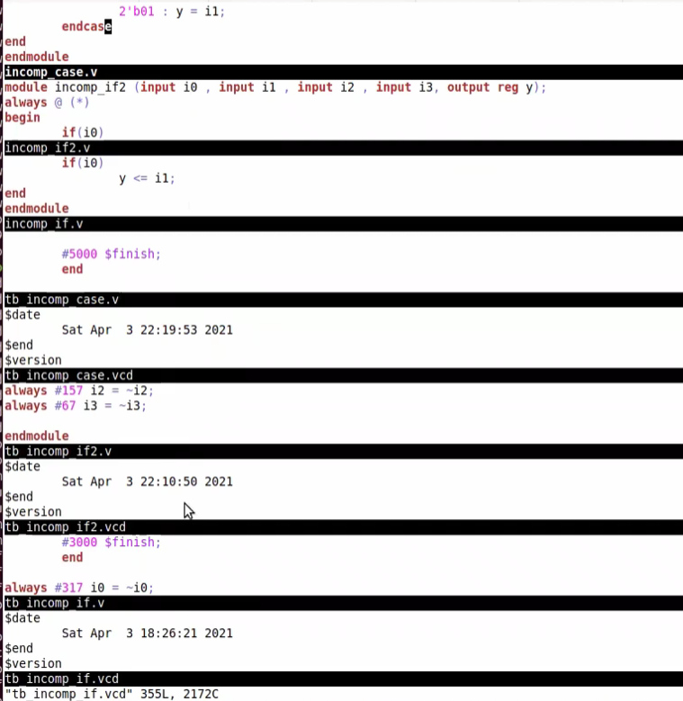


```bash
iverilog incomp_if.v tb_incomp_if.v
./a.out
gtkwave tb_incomp_if.vcd
```
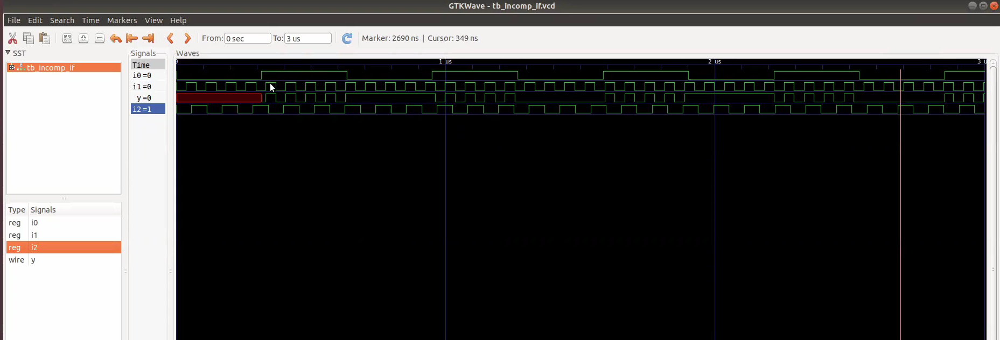

**Yosys Synthesis Flow:**

```bash
yosys
read_verilog incomp_if.v
synth -top incomp_if
abc -liberty ./lib/sky130_fd_sc_hd__tt_025C_1v80.lib
show
```
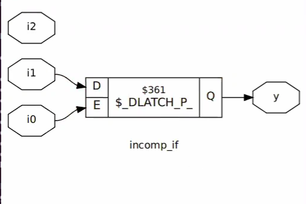

```bash
iverilog incomp_if2.v tb_incomp_if2.v
./a.out
gtkwave tb_incomp_if2.vcd
```
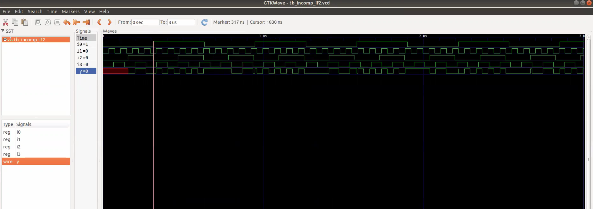

**Yosys Synthesis Flow:**

```bash
yosys
read_verilog incomp_if2.v
synth -top incomp_if2
abc -liberty ./lib/sky130_fd_sc_hd__tt_025C_1v80.lib
show
```
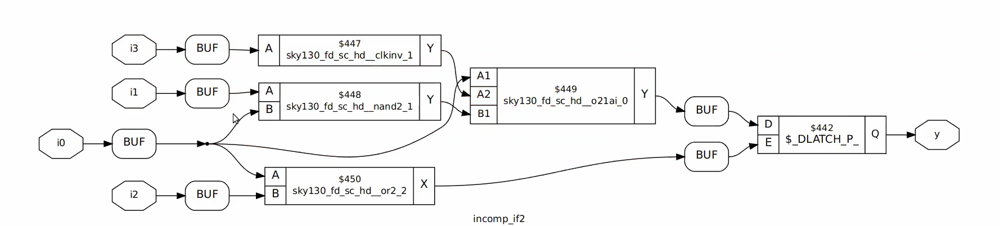

---

## 3️⃣ 🧪 Labs on "Incomplete Overlapping Case"

**Example: case block missing default**

```verilog
module incomp_case(input [1:0] sel, output reg y);
  always @(*) begin
    case (sel)
      2'b00: y = 1;
      2'b01: y = 0;
      // Missing 2'b10, 2'b11 – incomplete case
    endcase
  end
endmodule
```

**Run Commands:**

```
gvim comp_case.v -o incomp_case.v -o partial_case_assign.v -o bad_case.v
```
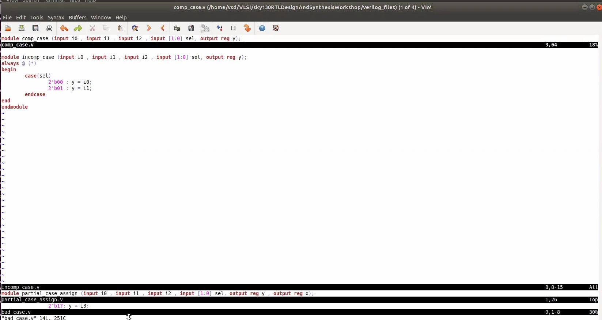


```bash
iverilog incomp_case.v tb_incomp_case.v
./a.out
gtkwave tb_incomp_case.vcd
```
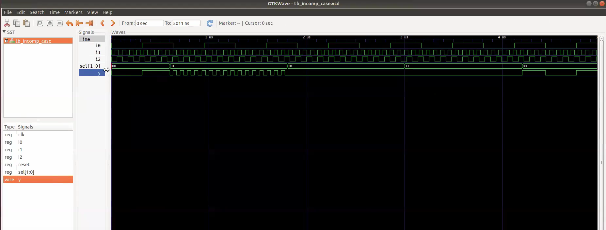

**Yosys Synthesis Flow:**

```bash
yosys
read_verilog incomp_case.v
synth -top incomp_case
abc -liberty ./lib/sky130_fd_sc_hd__tt_025C_1v80.lib
show
```
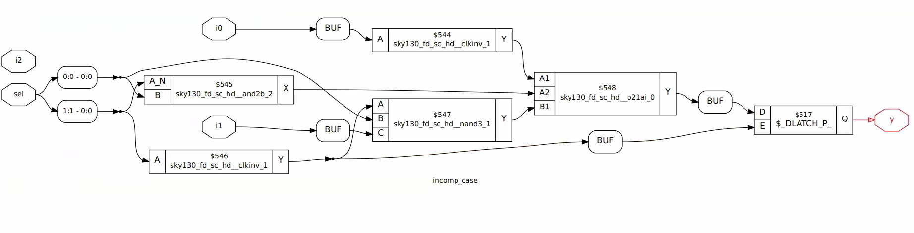

```bash
iverilog comp_case.v tb_comp_case.v
./a.out
gtkwave tb_comp_case.vcd
```
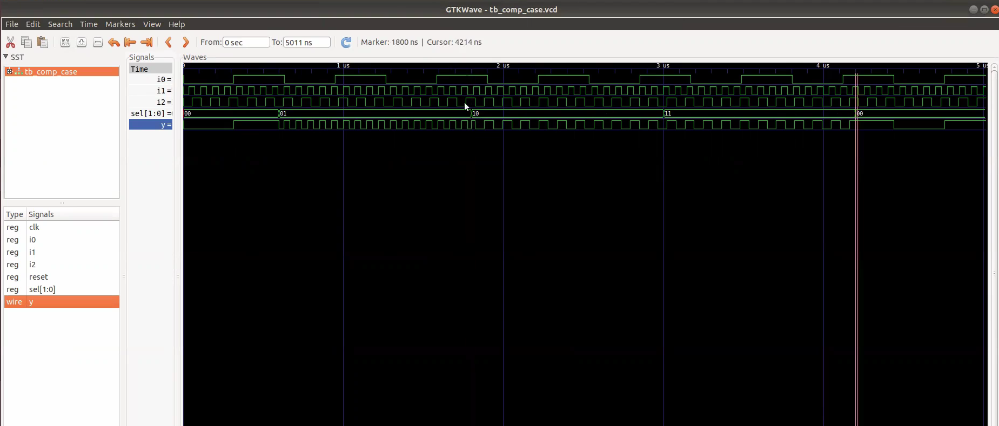

**Yosys Synthesis Flow:**

```bash
yosys
read_verilog partial_case_assign.v
synth -top partial_case_assign
abc -liberty ./lib/sky130_fd_sc_hd__tt_025C_1v80.lib
show
```
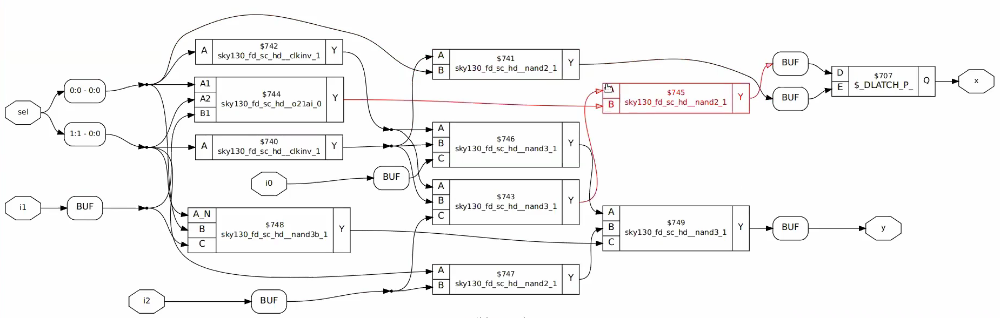

```bash
iverilog bad_case.v tb_bad_case.v
./a.out
gtkwave tb_bad_case.vcd
```
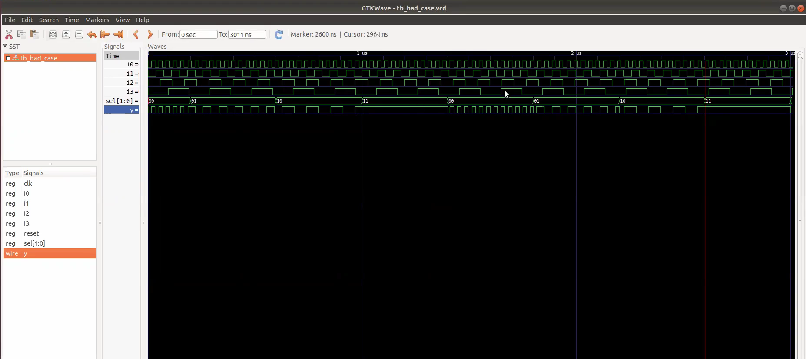

```bash
iverilog ../my_lib/verilog_model/primitives.v ../my_lib/verilog_model/sky130_fd_sc_hd.v bad_case.v tb_bad_case.v
./a.out
gtkwave tb_bad_case.vcd
```
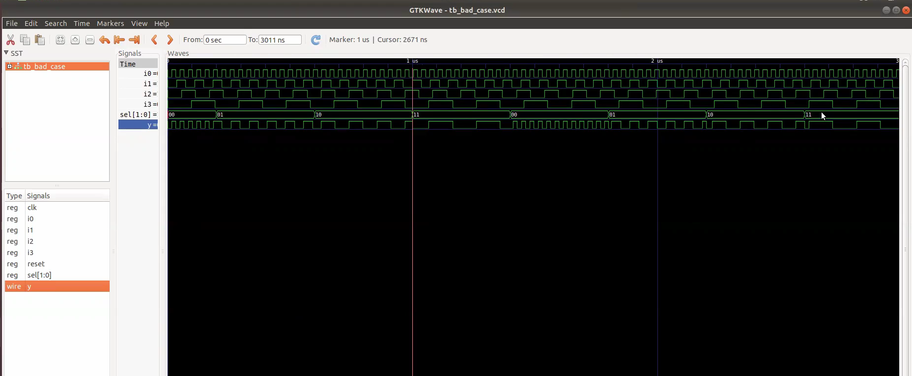

---

## 4️⃣ For Loop and For Generate

Loops in Verilog allow for cleaner code when generating repetitive hardware structures.

### `for` loop (behavioral simulation):

```verilog
module for_ex;
  integer i;
  initial begin
    for (i = 0; i < 5; i = i + 1)
      $display("i = %d", i);
  end
endmodule
```

### `generate for` (RTL synthesis):

```verilog
module mux_gen(input [3:0] a, input [3:0] b, input sel, output [3:0] y);
  genvar i;
  generate
    for (i = 0; i < 4; i = i + 1) begin : mux_loop
      assign y[i] = sel ? b[i] : a[i];
    end
  endgenerate
endmodule
```

---

## 5️⃣ 🧪 Labs on "For Loop and For Generate"

**Program using `for-generate`:**

```verilog
module down_gen(input [3:0] d, output [3:0] q);
  genvar i;
  generate
    for (i = 0; i < 4; i = i + 1) begin : gen_block
      assign q[i] = d[3 - i]; // reverse bits
    end
  endgenerate
endmodule
```

**Run Commands:**

```
gvim mux_generate.v
```
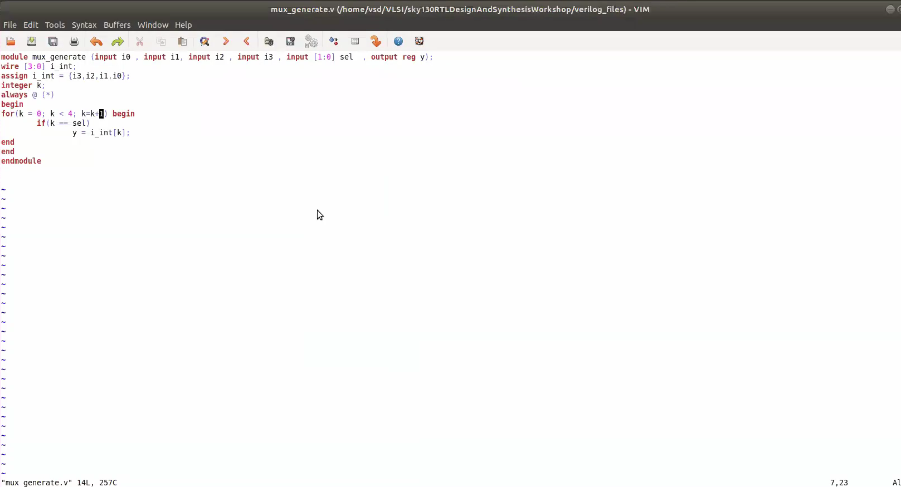

```bash
iverilog mux_generate.v tb_mux_generate.v
./a.out
gtkwave tb_mux_generate.vcd
```
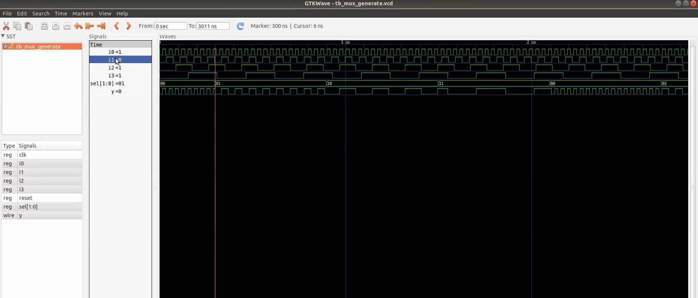

```
gvim demux_case.v -o demux_generate.v
```
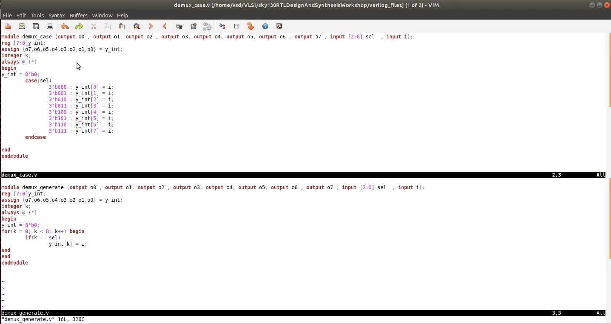


```bash
iverilog demux_case.v tb_demux_case.v
./a.out
gtkwave tb_demux_case.vcd
```
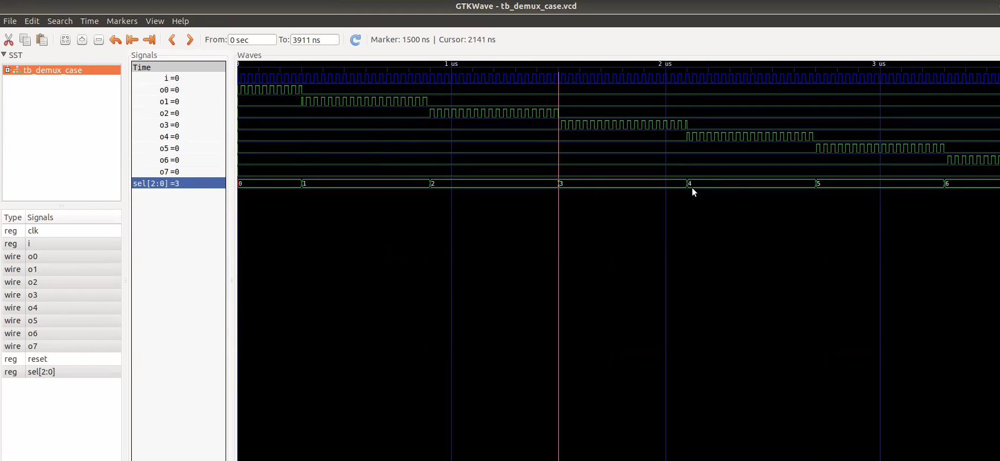


```bash
iverilog demux_generate.v tb_demux_generate.v
./a.out
gtkwave tb_demux_generate.vcd
```
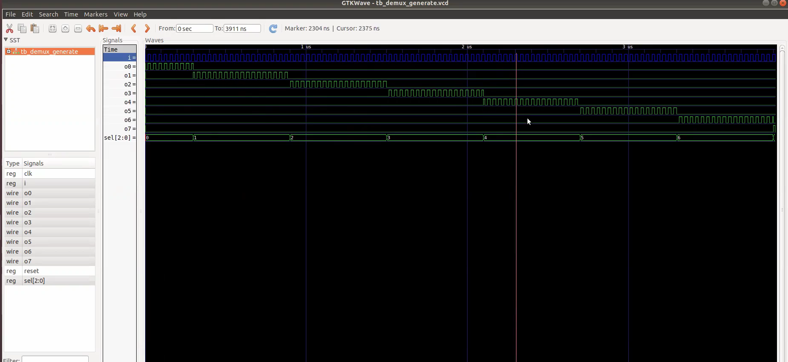


```bash
iverilog fa.v rca.v tb_rca.v
./a.out
gtkwave tb_rca.vcd
```
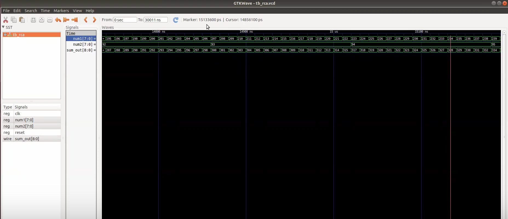

---

## ✅ Summary

- You learned how improper conditional logic can lead to synthesis issues.
- You explored incomplete `if` and `case` blocks and their effect on hardware inference.
- You used loops and `generate` blocks to create repetitive logic structures.
- You simulated and synthesized designs using **Icarus Verilog**, **GTKWave**, and **Yosys** with **Sky130 PDKs**.
- Understanding RTL optimization helps write clean, synthesis-friendly Verilog code.

